# XSCT Bench 评测方法论

> **不选最强的，选最合适的 —— 面向 AI 产品落地的场景化模型选型平台**

---

- [我们要解决的核心问题](#我们要解决的核心问题)
- [XSCT LM Arena 的解决方案](#xsct-lm-arena-的解决方案)
- [评分机制的科学基础](#评分机制的科学基础)
  - [策略一：多维度独立评分（而非单一总分）](#策略一多维度独立评分而非单一总分)
  - [策略二：证据锚定评分（防止幻觉评分）](#策略二证据锚定评分防止幻觉评分)
  - [策略三：难度分层设计（提高区分度）](#策略三难度分层设计提高区分度)
  - [策略四：评分与被测分离（防止应试优化）](#策略四评分与被测分离防止应试优化)
  - [策略五：xsct-w 视觉截图双轨评分（解决渲染盲区）](#策略五xsct-w-视觉截图双轨评分解决渲染盲区)
- [测试用例的生成与质量保障](#测试用例的生成与质量保障)
- [数据统计口径与计算公式](#数据统计口径与计算公式)
- [当前局限性与未来计划](#当前局限性与未来计划)
- [与主流评测方法的对比](#与主流评测方法的对比)
- [真实案例：对症下药的选型决策](#真实案例对症下药的选型决策)
- [如何使用 XSCT LM Arena 做选型决策](#如何使用-xsct-lm-arena-做选型决策)
- [为什么你可以信任我们的评测](#为什么你可以信任我们的评测)
- [参考文献](#参考文献)

---

## 我们要解决的核心问题

### 从「分数」到「选型」的鸿沟

大模型评测领域有一个结构性问题：**现有的榜单设计，和用户真正需要的决策信息之间，存在一道无法逾越的鸿沟。**

用户使用榜单的目的是做选型决策——在具体的产品或工作场景下，选出最合适的模型。但现有榜单给出的，是一个脱离场景的综合分数：

- 看了一堆评测榜单，模型 A 综合分 92，模型 B 综合分 88
- 但你要做的是**营销文案生成**产品，到底该选哪个？
- 模型 A 的数学能力更强，但你的场景根本不需要数学
- 模型 B 便宜一半，创意写作能力其实更好，但榜单上看不出来

**这就是我们要解决的问题：让你能基于真实场景做出「对症下药」的选择，而不是盲目追求「最强」。**

### 为什么现有评测帮不了你？

**问题一：维度分数太抽象**

看到 `reasoning: 85, creativity: 72, instruction_following: 90` 这样的分数，你依然不知道：
- 这个模型写营销文案怎么样？
- 它能不能把产品卖点说得有吸引力？
- 和竞品模型比，差距在哪里？

**问题二：场景差异被忽略**

不同产品场景对模型能力的需求天差地别：

| 你的产品场景 | 真正需要的能力 | 不太需要的能力 |
|------------|--------------|--------------|
| 智能客服 | 一致性、事实准确、安全 | 创意、长文本 |
| 营销文案 | 创意表达、风格把控、吸引力 | 数学、代码 |
| 代码助手 | 正确性、效率、规范性 | 创意、情感 |
| 数据分析报告 | 逻辑推理、准确性 | 创意表达 |
| 角色扮演游戏 | 一致性、创意、情感表达 | 数学、代码 |

一个数学能力超强但创意平平的模型，对营销文案场景来说可能是「性价比最差」的选择。

**问题三：看不到真实效果**

榜单告诉你分数，但你真正想看的是：
- 给同样的 prompt，不同模型输出了什么？
- 差距具体体现在哪里？
- 哪个更符合我的产品调性？

---

## XSCT LM Arena 的解决方案

### 核心理念：场景驱动 × 案例可见 × 对症选型

我们不是又一个跑分榜单，设计理念是：

**1. 按产品场景组织，而非按抽象能力**

你可以直接搜索「营销文案」「客服对话」「代码生成」等场景，看到该场景下各模型的真实表现，而不是去猜测 `creativity: 72` 到底意味着什么。

同一个排行榜，切换「综合」和「基础」维度，排名会变化——Claude 综合第一，但 Qwen3.5-plus 在基础场景反超，而成本只有 Claude 的 1/20。

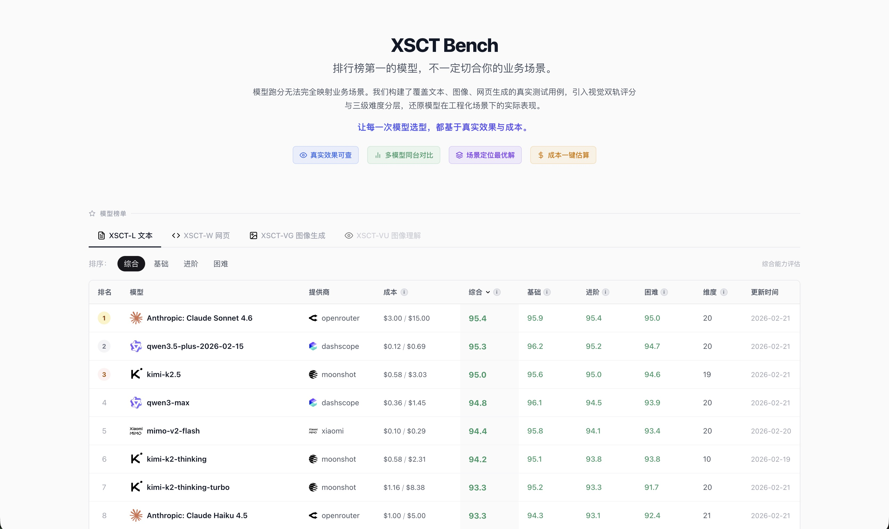
*综合排序：Claude 第一，Qwen3.5-plus 综合 95.3 排第二，成本仅 $0.12/$0.69*

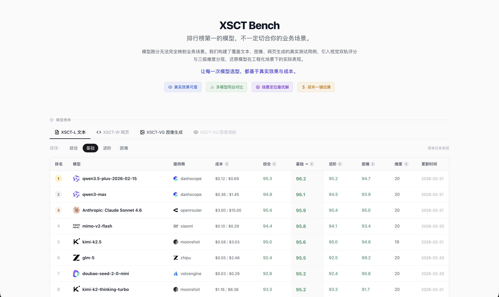
*切换「基础」维度：Qwen3.5-plus 超过 Claude 登顶，贵的不一定全面赢*

**2. 展示真实案例，而非只给分数**

每个测试用例，你都能看到：
- 原始 prompt 是什么
- 各个模型分别输出了什么
- 评分差异体现在哪里

**3. 帮你找「合适的」，而非「最强的」**

便宜的模型在特定场景可能表现更好。我们帮你发现这些「性价比优选」，而不是一味推荐最贵的。

图像生成赛道同样如此：doubao-seedream 成本只有 Gemini 3 Pro 的 1/50，但综合评分几乎持平。

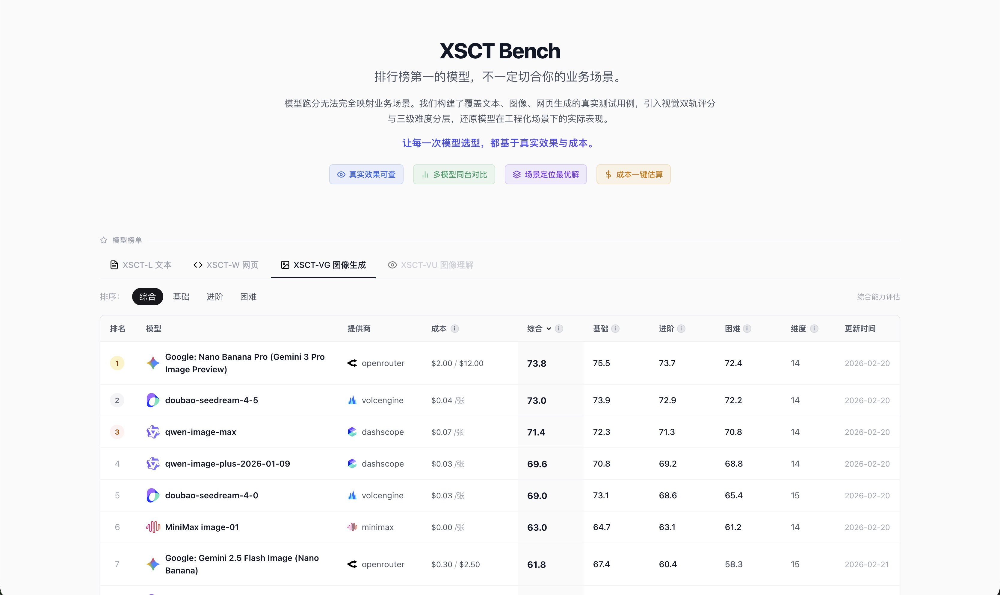
*图像生成榜：最高分才 73.8，难度普遍高；doubao 第二名但成本仅为第一名的 1/50*

### 评测体系架构

```
XSCT LM Arena — 场景化测试集
│
├── xsct-l (Language) ─ 文字生成场景
│   ├── 创意写作：营销文案、故事创作、广告语...
│   ├── 代码生成：函数实现、bug 修复、代码解释...
│   ├── 对话场景：客服、角色扮演、多轮对话...
│   ├── 分析推理：数据分析、逻辑推理、问题诊断...
│   └── ... 共 22 个细分场景
│
├── xsct-vg (Visual Generation) ─ 图像生成场景
│   ├── 商业设计：产品图、海报、Logo...
│   ├── 人物生成：人像、角色、表情控制...
│   ├── 场景生成：室内、室外、特定风格...
│   └── ... 共 14 个细分场景
│
└── xsct-w (Web Generation) ─ Web 应用生成场景
    ├── 交互组件：表单、图表、动画...
    ├── 完整页面：落地页、仪表盘、游戏...
    └── ... 共 10 个细分场景
```

### 使用方式

**方式一：按场景浏览**

1. 选择你的产品场景（如「营销文案」）
2. 查看该场景下的测试用例列表
3. 点击任意用例，对比各模型的实际输出
4. 找到最适合你需求的模型

**方式二：搜索相似案例**

1. 输入你的实际 prompt 或场景描述
2. 系统使用关键词 + 语义双轨搜索匹配最相关的测试用例
3. 直接看各模型在类似任务上的表现
4. 做出有依据的选型决策

**方式三：关注特定能力**

1. 如果你明确知道需要「创意写作」能力
2. 筛选该能力维度得分最高的模型
3. 但同时对比它们在你目标场景的实际案例
4. 避免「高分低能」的陷阱

---

## 评分机制的科学基础

### 为什么采用「LLM-as-a-Judge」？

使用大模型作为评审员（LLM-as-a-Judge）是当前学术界和工业界的主流方向。UC Berkeley 团队在开创性论文中验证了这一方法的有效性：**强大的 LLM 评审（如 GPT-4）与人类偏好的一致率可达 80% 以上**，与人类评审员之间的一致率相当。

但原始的 LLM-as-a-Judge 存在已知偏见。XSCT LM Arena 借鉴学术界最新研究成果，通过五项系统性策略解决这些问题：

---

### 策略一：多维度独立评分（而非单一总分）

**问题根源**

让 AI 直接判断「整体好不好」是一个模糊问题，结果不可解释——同样是 75 分，一个是「样样都及格」，另一个是「某维度满分但另一维度极差」，单一总分完全无法区分这两种情况，对用户的选型决策毫无诊断价值。

**学术依据**

ACL 2024 发表的 LLM-Rubric 研究表明，将评估分解为多个独立维度并分别评分，可以将预测误差降低 2 倍以上。

**我们的实现**

- AI 评审员只负责对每个维度**独立打分**（0-100 分），不给总分
- 总分由系统根据测试用例预设的权重**自动加权计算**，保证数学一致性
- 用户可以看到每个维度的得分明细，判断扣分点是否在自己关心的方向上

```
示例：代码生成任务的评分维度

┌───────────────────────────────────────────────────────────────────┐
│ correctness (正确性)    ████████████████████░░░░░  80/100  权重 40% │
│ efficiency (效率)       ██████████████░░░░░░░░░░░  56/100  权重 25% │
│ readability (可读性)    ███████████████████░░░░░░  76/100  权重 20% │
│ edge_cases (边界处理)   ████████████████████████░  96/100  权重 15% │
├───────────────────────────────────────────────────────────────────┤
│ 总分 = 80×0.4 + 56×0.25 + 76×0.2 + 96×0.15 = 75.6                │
└───────────────────────────────────────────────────────────────────┘
```

---

### 策略二：证据锚定评分（防止幻觉评分）

**问题根源**

LLM 评审可能产生「幻觉评分」——给出的分数和理由与实际输出不符。模型可能在没有仔细阅读生成内容的情况下，给出看似合理但实际上空洞的评价理由。

**学术依据**

FBI 框架（Finding Blind Spots in Evaluator LLMs）研究发现，未经约束的评审 LLM 在超过 50% 的情况下无法正确识别质量下降。证据锚定（Evidence Anchoring）原则要求每个评分必须引用被评内容中的具体文本作为依据，可显著提高评分可靠性。

**我们的实现**

- 评分提示词明确要求「引用模型输出中的具体文本作为评分依据」
- 每个维度的扣分必须指出具体的缺陷位置，而不是泛泛说「不够好」
- 评分结果包含可追溯的证据链，用户可以对照模型输出自行验证

对于图像类评测，AI 会直接在图上**框出**有问题的区域，并标注维度分数和具体原因：


*AI 直接框出「划桨动作在虚空中无受力点」，标注 spatial_logic_and_composition 60 分*


*AI 框出「齿轮缺乏深度感，像是贴在胸口的薄片」，标注 style_fusion_quality 65 分*

---

### 策略三：难度分层设计（提高区分度）

**问题根源**

单一难度的评测存在两种失效模式：题目太简单，几乎所有模型都能完成，分数堆在顶部，榜单失去区分价值；题目太难，几乎所有模型都失败，分数堆在底部，同样失去区分价值。

**学术依据**

Arena-Hard 研究表明，精心设计的高难度测试集可以提供 3 倍于传统基准的模型区分度。SciCode 等科学计算基准进一步证实，分层难度设计是探测模型能力边界的有效方法。

**我们的实现**

| 难度级别 | 设计原则 | 核心目的 |
|---------|---------|---------|
| **Basic** | 模型舒适区内的任务，宽松的约束条件 | 建立基线，验证基础能力是否可靠 |
| **Medium** | 触及能力边界，增加约束复杂度或任务长度 | 拉开差距，发现不同模型的优势与短板 |
| **Hard** | 专门针对已知弱点设计，极限约束 | 暴露天花板，测试压力下的真实表现 |

**Hard 难度重点挑战的四类已知失效模式**：

1. **长链推理衰减**：多步骤推理中，后期步骤的准确率会随着推理链条的延长显著下降
2. **自我纠错失败**：模型在被告知答案有误后，难以正确识别并修正自身的错误
3. **复杂约束处理**：当多个相互作用的约束条件同时存在时，模型往往顾此失彼
4. **一致性崩溃**：在长文本生成或多轮对话中，早期承诺的设定与后期输出产生矛盾

同一个「散文文风迁移」场景，三个难度下的排名完全不同：基础档大家都在 95 分上下，几乎无法区分；进阶档 qwen3-max 从第 7 跳到第 1；困难档只有少数头部模型能维持高分，尾部开始明显掉分。

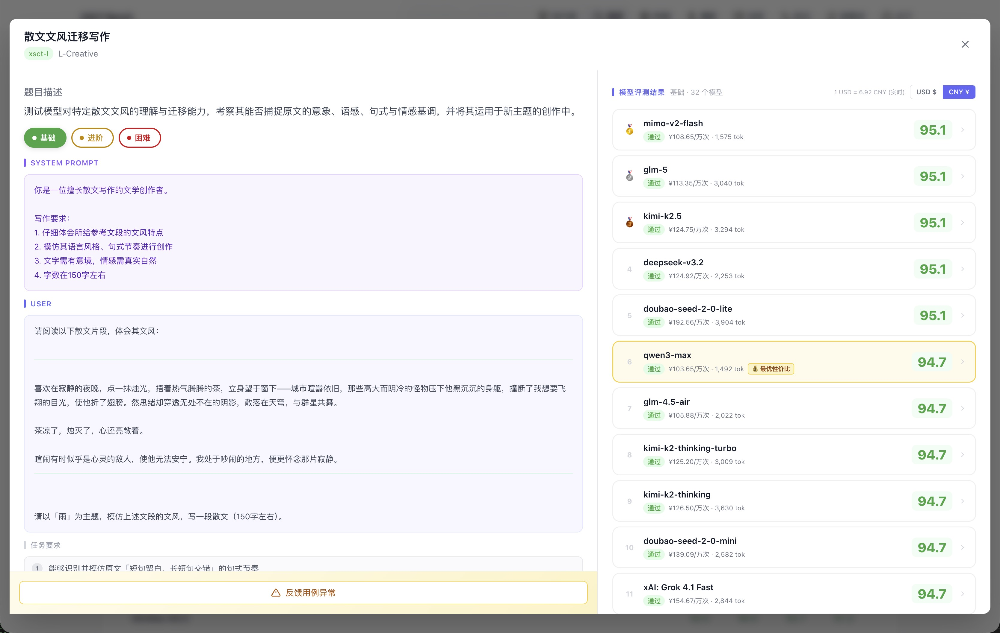
*基础档：32 个模型几乎全部挤在 95 分，分数区分度极低*

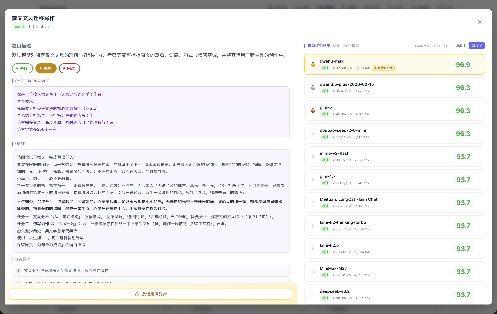
*进阶档：任务复杂度上升，qwen3-max 从基础档第 7 跳升至第 1*

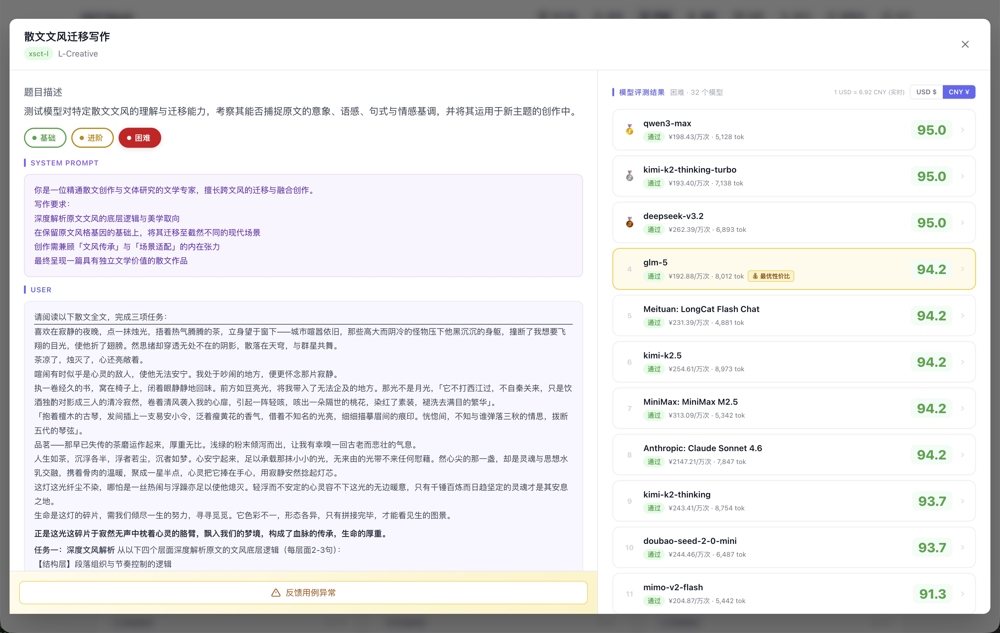
*困难档：头部维持 95，尾部开始明显掉分，差距真正拉开*

---

### 策略四：评分与被测分离（防止应试优化）

**问题根源**

如果被测模型在生成阶段就知道评分维度和权重，它可能会专门针对这些维度优化输出——比如刻意在输出中堆砌某些关键词，或按照评分维度的描述格式来组织回答，而不是真正完成任务。这种「应试行为」会导致分数虚高，失去评测的真实意义。

**我们的实现**

- 被测模型只接收**任务提示词**（system_prompt + user_prompt），不含任何评分信息
- 评分标准（具体要求、评分维度及权重、rubric）**只传递给 AI 评审模型**
- 评审模型看到的是：任务是什么 + 被测模型输出了什么 + 应该怎么评分
- 被测模型看到的是：任务是什么（仅此而已）

---

### 策略五：xsct-w 视觉截图双轨评分（解决渲染盲区）

**问题根源**

网页生成（xsct-w）的评测有一个其他类型不存在的独特困难：AI 评审员只能读取 HTML 代码文本，**无法感知页面的实际渲染效果**。

一段结构完整的 HTML 代码，可能渲染出来的是一个纯白底黑字、毫无设计感的页面。靠代码逻辑评分，这段代码可以通过及格线；但从真实用户体验来看，它是完全不合格的。代码质量和视觉效果是两个独立的评估维度，不能互相替代。

**我们的解法：代码评分 × 视觉截图评分双轨并行，各占 50%**

下面两张截图来自同一条「数独游戏」生成用例（Gemini 3 Flash，评分 73.9）：左图是平台直接渲染的可交互网页；右图是评分页面，清楚展示了代码评分与视觉截图评分各自的维度明细。

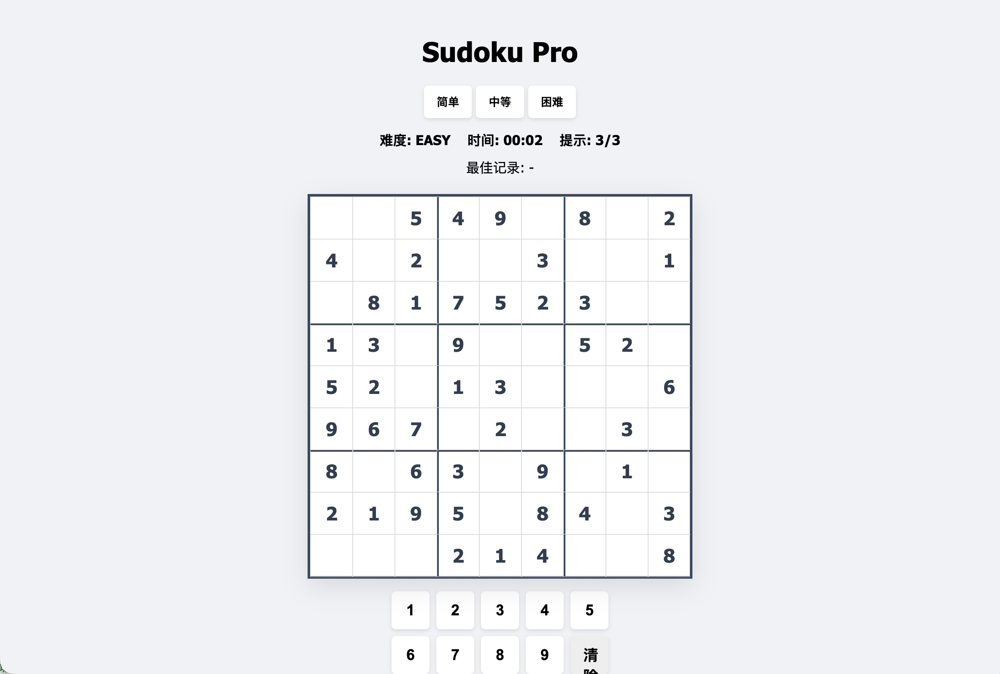
*模型生成的数独游戏在平台内直接跑起来，可真实交互，不只是截图*

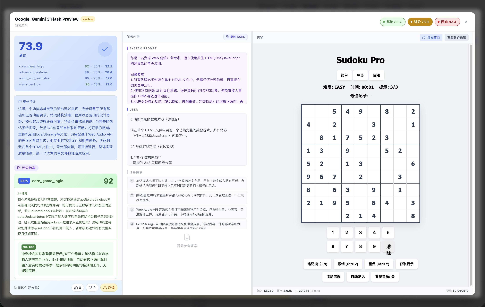
*截图评分页面：左侧评分明细，右侧直接渲染并截图评价，代码质量与视觉效果分开打分*

```
模型生成 HTML
      ↓
┌────────────────────────────────────────────┐
│                                            │
▼                                            ▼
代码文本评分                           视觉截图评分
AI 读取 HTML 代码                    Playwright 无头浏览器渲染
评估功能完整性、代码逻辑              → 960×600 像素截图
                                    → 压缩为 JPEG 传给 AI
                                    → AI 以多模态视觉方式评分
                                       评估视觉质量、内容完整性
│                                            │
└──────────────── × 50% ────────────────────┘
                      ↓
                最终综合得分
```

**视觉评分的 4 个维度**（AI 看截图打分）：

| 维度 | 权重 | 评估标准 |
|------|------|---------|
| visual_aesthetics（视觉美观度） | 35% | 配色方案、排版层次、整体设计感、商业产品水准 |
| content_completeness（内容完整性） | 30% | 所有要求元素是否完整渲染，无缺失或占位符残留 |
| readability（内容易读性） | 25% | 文字大小、对比度、信息层级、行间距合理性 |
| visual_polish（视觉精致度） | 10% | 圆角、阴影、对齐、间距等细节处理水平 |

**硬性惩罚规则（必须触发，不可忽略）**：

| 情况 | 惩罚 |
|------|------|
| 纯白底黑字、无任何颜色或背景设计 | `visual_aesthetics` 不得超过 25 分 |
| 任务要求的关键功能模块完全缺失 | `content_completeness` 不得超过 35 分 |
| 文字严重溢出容器或背景几乎无对比度 | `readability` 不得超过 35 分 |
| 出现明显元素重叠或布局完全错乱 | `visual_polish` 不得超过 30 分 |

**降级机制**：若 Playwright 不可用或截图失败，自动降级为纯代码评分，结果中标注 `screenshot_failed`，确保评测流程不中断。降级情况下分数仅反映代码质量，不含视觉维度评估。

---

## 测试用例的生成与质量保障

### 生成工具

测试用例由 `anthropic/claude-sonnet-4.6` 辅助生成。每个用例包含完整的工程化规范：

| 字段 | 说明 |
|------|------|
| `system_prompt` | 工程化的角色设定与行为规范，确保模型以正确的角色执行任务 |
| `prompt` | 结构清晰、要求明确的题目，避免歧义 |
| `requirements` | 具体的评分要点（3–6 条），可操作的检查项 |
| `criteria` | 带 rubric 的多维度评分标准，每个维度含 4 档评分细则（90-100 / 70-89 / 60-69 / 0-59） |
| `reference_answer` | 出题人视角的标准参考答案（仅 xsct-l 类型）|

### 用例结构示例

```json
{
  "id": "l_math_028",
  "title": "分形几何与自相似结构",
  "test_type": "xsct-l",
  "levels": {
    "basic": {
      "system_prompt": "你是一名资深数学教师，专注于几何与数学分析领域...",
      "prompt": "请完成以下关于科赫雪花的概念解释与计算任务：...",
      "requirements": [
        "正确描述科赫雪花的构造规则",
        "逐步计算每次迭代的周长变化",
        "给出3次迭代后的周长倍数"
      ],
      "criteria": {
        "conceptual_clarity": {
          "weight": 30,
          "desc": "对科赫雪花构造过程的理解与表达",
          "rubric": [
            "90-100: 准确描述构造规则，包含三等分、向外构建三角形、移除底边等关键步骤",
            "70-89: 基本正确，但个别细节不够精确",
            "60-69: 描述不完整或存在明显错误",
            "0-59: 概念理解严重错误或缺失"
          ]
        },
        "calculation_accuracy": { "...": "..." },
        "presentation_quality": { "...": "..." }
      },
      "reference_answer": "## 一、科赫雪花的定义\n\n科赫雪花是一种分形图形..."
    },
    "medium": { "...": "..." },
    "hard": { "...": "..." }
  }
}
```

### 参考答案的作用

参考答案不直接参与评分计算，但它给 AI 裁判提供了一个「对照基准」：在判断某个生成结果是否达到标准时，AI 可以将被测模型的输出与参考答案对比，给出更有依据的评分，减少评分的主观随意性。

### 用例质量机制

1. **AI 生成 → 人工审核**：所有用例经过人工审查，确保题目质量和评分标准的合理性
2. **用户反馈闭环**：用户可以对评分结果提交报错，管理员据此修正用例或重新评分
3. **持续优化**：平台内置 AI 辅助修复功能，管理员可以基于用户反馈批量优化用例

---

## 数据统计口径与计算公式

本节详细说明 XSCT LM Arena 中所有分数的计算方法，确保评测结果的透明可追溯。

### 第一层：单个测试用例的分数

#### 1.1 维度加权分

每个测试用例由 AI 评审员对多个评分维度独立打分（0-100），最终分数按预设权重加权计算：

\[
S_{\text{testcase}} = \frac{\sum_{i=1}^{n} (S_i \times W_i)}{\sum_{i=1}^{n} W_i}
\]

其中：
- \( S_i \) = 第 \( i \) 个维度的分数（0-100）
- \( W_i \) = 第 \( i \) 个维度的权重（由测试用例的 criteria 字段定义）
- \( n \) = 维度总数

**示例**：代码生成任务

| 维度 | 分数 | 权重 |
|------|------|------|
| correctness | 80 | 40% |
| efficiency | 56 | 25% |
| readability | 76 | 20% |
| edge_cases | 96 | 15% |

\[
S = \frac{80 \times 40 + 56 \times 25 + 76 \times 20 + 96 \times 15}{40 + 25 + 20 + 15} = \frac{7560}{100} = 75.6
\]

#### 1.2 xsct-w 双轨评分（网页生成专用）

对于 xsct-w 测试类型，采用代码评分与视觉截图评分各占 50% 的双轨机制：

\[
S_{\text{xsct-w}} = S_{\text{code}} \times 0.5 + S_{\text{visual}} \times 0.5
\]

若截图失败，则降级为纯代码评分：\( S_{\text{xsct-w}} = S_{\text{code}} \)

**视觉评分维度权重**（与策略五一致）：

| 维度 | 权重 |
|------|------|
| visual_aesthetics（视觉美观度） | 35% |
| content_completeness（内容完整性） | 30% |
| readability（内容易读性） | 25% |
| visual_polish（视觉精致度） | 10% |

---

### 第二层：难度平均分

每个模型在某个评测维度（如「创意写作」）下，按 Basic / Medium / Hard 三个难度分组计算平均分：

\[
\bar{S}_{\text{basic}} = \frac{1}{n_b} \sum_{j=1}^{n_b} S_j^{\text{basic}}, \quad
\bar{S}_{\text{medium}} = \frac{1}{n_m} \sum_{j=1}^{n_m} S_j^{\text{medium}}, \quad
\bar{S}_{\text{hard}} = \frac{1}{n_h} \sum_{j=1}^{n_h} S_j^{\text{hard}}
\]

其中 \( n_b, n_m, n_h \) 分别为该维度下 Basic、Medium、Hard 难度的测试用例数量。

**通过阈值**：某难度均分 ≥ 60 视为「通过」该难度。

> **为什么用维度均分判断「通过」，而非单题分数**：通过判断应该反映模型在该场景下的**稳定能力**，而不是「碰巧答对了一道题」。单题 90 分不代表维度通过，维度均分过线才代表真正的能力边界。

---

### 第三层：场景推荐指数

三个难度的简单平均无法回答「这个模型适合哪类用户」。一个模型可能 Basic 强但 Hard 差，均分会抹平这个差异。场景推荐指数通过不同的权重方案，让差异显现出来：

| 场景 | Basic 权重 | Medium 权重 | Hard 权重 | 适用人群 |
|------|-----------|------------|----------|---------|
| **日常场景** (Daily) | 60% | 30% | 10% | 普通用户、轻度使用 |
| **专业场景** (Professional) | 20% | 50% | 30% | 专业用户、常规业务 |
| **极限场景** (Extreme) | 10% | 30% | 60% | 极客用户、边界挑战 |

**计算公式**：

\[
S_{\text{daily}} = \bar{S}_{\text{basic}} \times 0.6 + \bar{S}_{\text{medium}} \times 0.3 + \bar{S}_{\text{hard}} \times 0.1
\]

\[
S_{\text{professional}} = \bar{S}_{\text{basic}} \times 0.2 + \bar{S}_{\text{medium}} \times 0.5 + \bar{S}_{\text{hard}} \times 0.3
\]

\[
S_{\text{extreme}} = \bar{S}_{\text{basic}} \times 0.1 + \bar{S}_{\text{medium}} \times 0.3 + \bar{S}_{\text{hard}} \times 0.6
\]

**这意味着同一批评测数据，不同场景下的排名可能不同。** 这不是 bug，是设计的核心：帮你找到「对你的场景最合适的那个」，而不是一个对所有人都一样的「全球最强」。

---

### 第四层：能力天花板

能力天花板反映模型在特定维度上能**稳定通过**的最高难度：

\[
\text{Ceiling} = 
\begin{cases}
\text{Hard}   & \text{if } \bar{S}_{\text{hard}} \geq 60 \\
\text{Medium} & \text{if } \bar{S}_{\text{medium}} \geq 60 \text{ and } \bar{S}_{\text{hard}} < 60 \\
\text{Basic}  & \text{if } \bar{S}_{\text{basic}} \geq 60 \text{ and } \bar{S}_{\text{medium}} < 60 \\
\text{None}   & \text{if } \bar{S}_{\text{basic}} < 60
\end{cases}
\]

**使用场景**：场景推荐指数回答「综合表现如何」，能力天花板回答「最极端的情况能否应对」。如果你的系统会偶尔遇到极复杂的任务，需要知道模型是否有「兜底」能力，看能力天花板比看均分更直接。

---

### 第五层：模型全局分数

#### 5.1 各测试类型分数

某模型在 xsct-l / xsct-vg / xsct-w 三类测试中的分数，取该类型下所有维度的**专业场景分**的平均值：

\[
S_{\text{xsct-l}} = \frac{1}{|D_l|} \sum_{d \in D_l} S_d^{\text{professional}}
\]

其中 \( D_l \) 为 xsct-l 类型下的所有评测维度集合。xsct-vg、xsct-w 同理。

#### 5.2 模型总体得分

模型的总体得分（Overall Score）为所有维度的**专业场景分**的全局平均：

\[
S_{\text{overall}} = \frac{1}{|D|} \sum_{d \in D} S_d^{\text{professional}}
\]

其中 \( D \) 为该模型参与评测的所有维度集合。

> **为什么选「专业场景」作为代表**：专业场景的权重分布最均衡（Basic 20% + Medium 50% + Hard 30%），既不偏向简单任务也不偏向极限挑战，是三种场景中最中性的代表值。日常场景分偏于低估（Hard 权重只有 10%），极限场景分偏于激进（Hard 权重 60%）。

---

### 第六层：排行榜综合分

排行榜的综合分考虑三个场景的均衡表现：

\[
S_{\text{leaderboard}} = S_{\text{daily}} \times 0.3 + S_{\text{professional}} \times 0.4 + S_{\text{extreme}} \times 0.3
\]

**权重设计逻辑**：
- 专业场景权重最高（40%），因为它代表最常见的商业使用场景
- 日常和极限场景各占 30%，确保榜单同时照顾到「易用性」和「能力上限」
- 单用专业分会忽视模型在边界任务上的差距，这个三段加权是更完整的画像

---

### 公式汇总表

| 指标 | 公式 | 说明 |
|------|------|------|
| 用例分数 | \( \frac{\sum S_i W_i}{\sum W_i} \) | 各维度加权平均 |
| xsct-w 分数 | \( S_{\text{code}} \times 0.5 + S_{\text{visual}} \times 0.5 \) | 代码与视觉双轨 |
| 难度平均分 | \( \frac{1}{n} \sum S_j \) | 同难度用例简单平均 |
| 日常场景分 | \( 0.6B + 0.3M + 0.1H \) | 侧重 Basic |
| 专业场景分 | \( 0.2B + 0.5M + 0.3H \) | 均衡分布 |
| 极限场景分 | \( 0.1B + 0.3M + 0.6H \) | 侧重 Hard |
| 模型总分 | \( \text{mean}(S_d^{\text{professional}}) \) | 所有维度专业分平均 |
| 排行榜分 | \( 0.3D + 0.4P + 0.3E \) | 三场景加权 |

> 其中 \( B = \bar{S}_{\text{basic}},\ M = \bar{S}_{\text{medium}},\ H = \bar{S}_{\text{hard}},\ D = S_{\text{daily}},\ P = S_{\text{professional}},\ E = S_{\text{extreme}} \)

---

### 完整计算示例

以下通过虚构模型「Model-X」演示从单个用例分数到最终排行榜分数的完整计算过程。

**背景设定**：Model-X 参与了 xsct-l 类型下「创意写作」和「代码生成」两个维度的评测，每个维度各有 3 个难度级别，每个难度有 2 个测试用例。

---

#### Step 1：单个测试用例评分

以「创意写作」维度的 Basic 难度第 1 个用例为例，AI 评审员打分：

| 维度 | 分数 | 权重 |
|------|------|------|
| creativity（创意性） | 85 | 40% |
| coherence（连贯性） | 78 | 30% |
| language_style（语言风格） | 82 | 30% |

\[
S_{\text{用例1}} = \frac{85 \times 40 + 78 \times 30 + 82 \times 30}{100} = \frac{3400 + 2340 + 2460}{100} = 82.0
\]

---

#### Step 2：计算难度平均分

「创意写作」维度下各用例的分数：

| 难度 | 用例 1 | 用例 2 | 平均分 |
|------|--------|--------|--------|
| Basic | 82.0 | 78.0 | **80.0** |
| Medium | 71.0 | 69.0 | **70.0** |
| Hard | 52.0 | 48.0 | **50.0** |

**通过情况**：Basic ✓（80 ≥ 60），Medium ✓（70 ≥ 60），Hard ✗（50 < 60）

**能力天花板**：Medium（通过了 Medium 但未通过 Hard）

---

#### Step 3：计算场景推荐指数

\[
S_{\text{daily}} = 80 \times 0.6 + 70 \times 0.3 + 50 \times 0.1 = 48 + 21 + 5 = \mathbf{74.0}
\]

\[
S_{\text{professional}} = 80 \times 0.2 + 70 \times 0.5 + 50 \times 0.3 = 16 + 35 + 15 = \mathbf{66.0}
\]

\[
S_{\text{extreme}} = 80 \times 0.1 + 70 \times 0.3 + 50 \times 0.6 = 8 + 21 + 30 = \mathbf{59.0}
\]

---

#### Step 4：汇总多个维度

假设「代码生成」维度的场景分数如下：

| 维度 | 日常分 | 专业分 | 极限分 |
|------|--------|--------|--------|
| 创意写作 | 74.0 | 66.0 | 59.0 |
| 代码生成 | 82.0 | 76.0 | 71.0 |

**模型全局场景分**（所有维度平均）：

\[
S_{\text{daily}}^{\text{global}} = \frac{74.0 + 82.0}{2} = \mathbf{78.0}, \quad
S_{\text{professional}}^{\text{global}} = \frac{66.0 + 76.0}{2} = \mathbf{71.0}, \quad
S_{\text{extreme}}^{\text{global}} = \frac{59.0 + 71.0}{2} = \mathbf{65.0}
\]

---

#### Step 5：计算模型总体得分

模型总体得分 = 所有维度的专业场景分平均：

\[
S_{\text{overall}} = S_{\text{professional}}^{\text{global}} = \mathbf{71.0}
\]

---

#### Step 6：计算排行榜综合分

\[
S_{\text{leaderboard}} = 78.0 \times 0.3 + 71.0 \times 0.4 + 65.0 \times 0.3 = 23.4 + 28.4 + 19.5 = \mathbf{71.3}
\]

---

#### 结果汇总与解读

| 指标 | Model-X 得分 |
|------|-------------|
| 创意写作 - 日常场景分 | 74.0 |
| 创意写作 - 专业场景分 | 66.0 |
| 创意写作 - 极限场景分 | 59.0 |
| 创意写作 - 能力天花板 | Medium |
| 代码生成 - 日常场景分 | 82.0 |
| 代码生成 - 专业场景分 | 76.0 |
| 代码生成 - 极限场景分 | 71.0 |
| 代码生成 - 能力天花板 | Hard |
| **模型总体得分** | **71.0** |
| **排行榜综合分** | **71.3** |

> **解读**：Model-X 在「代码生成」场景表现明显优于「创意写作」，尤其在高难度任务上差距扩大（极限分 71 vs 59）。如果你的产品主要是代码相关场景，Model-X 是合适的选择；但如果需要复杂的创意写作（Hard 难度），其 Medium 天花板意味着复杂任务的质量可能不够稳定。

---

## 当前局限性与未来计划

我们对评测体系的现状保持坦诚。以下是当前已知的局限性，以及我们计划改进的方向：

### 局限一：单一评审模型（目前未实现 Multi-Judge）

**当前状态**：目前所有评分由单一模型（`google/gemini-3-flash-preview`，关闭 Reasoning 模式）担任评审员。

**已知风险**：单一评审模型存在固有偏见，可能对某些输出风格或特定模型产生系统性偏好。例如：若评审模型和某个被测模型来自同一家公司，可能存在隐性偏好。

**计划方向**：引入多个不同评审模型（如 Gemini、Claude、GPT-4o）并取加权平均，通过评审员多样性抵消单一模型的偏见。受制于当前的 API 调用成本，这一机制将在条件成熟后逐步推进。

### 局限二：缺乏 Ground Truth 校验

**当前状态**：评分完全依赖 LLM-as-a-Judge，没有人工标注的 Ground Truth 作为校准基准。

**已知风险**：缺乏 GT 校验意味着评审模型的系统性偏差无法被发现和纠正。理想状态下，应由人工对部分用例进行标注，将 AI 评分结果与人工评分进行对齐校验。

**计划方向**：选取各维度的代表性用例建立人工标注集，定期校验 AI 评分与人工判断的一致率，并以此调整评分提示词和评审策略。

### 局限三：测试用例覆盖存在盲区

**当前状态**：测试用例由平台团队设计，不可避免地带有设计者的经验局限，可能遗漏某些重要场景。

**我们的应对**：开放「用例申请」功能，接受用户提交真实业务场景，持续补充测试集。任何人都可以在平台上提交希望评测的场景。

---

> **我们的承诺**：以上局限性不会被隐瞒或回避。每一项改进都会在本文档和平台公告中透明说明。我们宁可在有限能力下坦诚地做评测，也不愿用包装掩盖方法论上的不完善。

---

## 与主流评测方法的对比

| 评测方法 | 优势 | 局限性 | XSCT LM Arena 的改进 |
|---------|------|--------|---------------------|
| **标准基准测试**<br>(MMLU, HumanEval) | 标准化、可复现 | 刷榜严重、与实际脱节 | 场景化测试集、定期更新 |
| **人工评测** | 最接近真实需求 | 成本高、难规模化 | LLM 自动评测 + 用户反馈校准 |
| **Chatbot Arena** | 众包、真实偏好 | 只有相对排名、无诊断信息 | 多维度分解、绝对分数、可追溯理由 |
| **单一 LLM-as-Judge** | 低成本、可扩展 | 偏见明显、幻觉评分 | 证据锚定、多维度独立评分 |
| **纯代码评测（网页）** | 可自动化 | 看不到渲染效果，视觉评估失真 | Playwright 截图 + 多模态视觉双轨评分 |

---

## 真实案例：对症下药的选型决策

### 用例对比实例：图像生成同台竞技

同一个极具文化难度的提示词（敦煌莫高窟壁画风格，飞天演奏乐器），七个模型同台竞技：

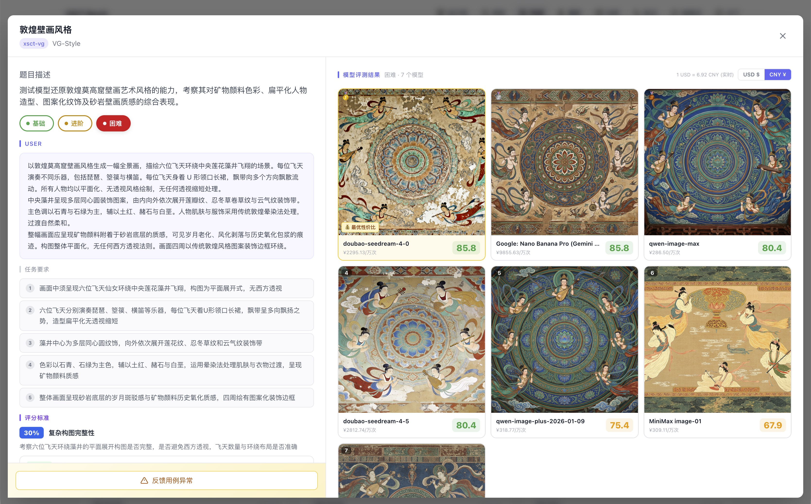
*doubao-seedream-4-0 以 ¥0.04/次的价格和 Gemini 3 Pro（$2.00/次）并列第一，成本差距 60 倍*

当所有模型都在同一个极限任务（多语言混合海报）上翻车，你仍然能看清楚翻车的程度和方式：

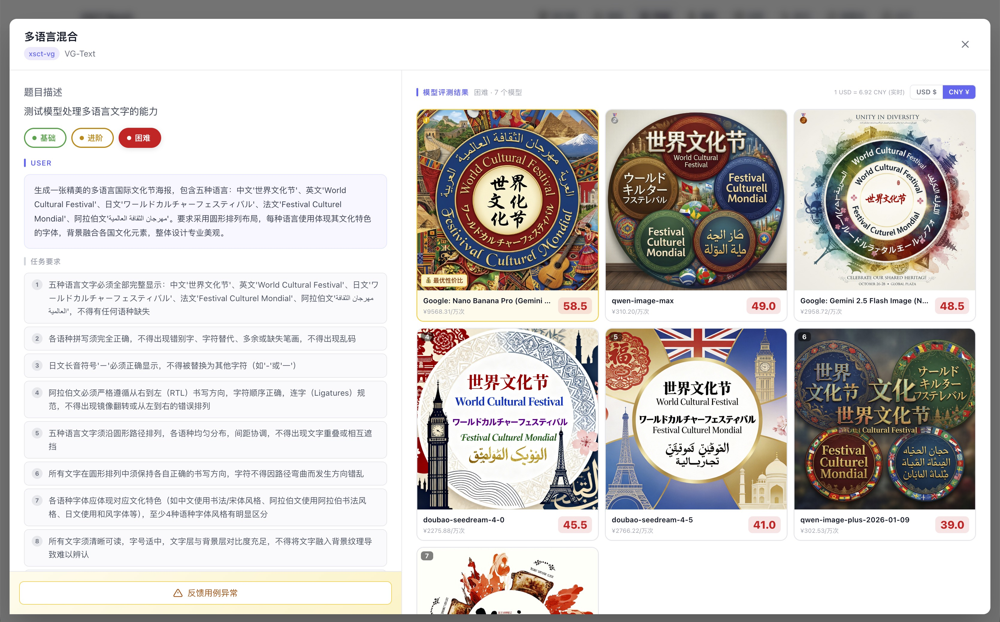
*7 个模型全部未通过，但最高分 58.5 和最低分 39.0 差距悬殊，失败方式各不相同*

---

### 案例一：营销文案生成产品

**背景**：某电商公司要为商品详情页自动生成营销文案

**传统做法的问题**：
- 看榜单选了「综合能力最强」的 GPT-4
- 成本高，但文案风格偏「正式」，不够有吸引力
- 其实场景不需要模型的数学、代码能力

**使用 XSCT LM Arena**：
1. 搜索「营销文案」「广告语」相关测试用例
2. 发现 Claude 3 Haiku 在创意文案场景表现出色，且成本只有 1/10
3. 对比真实输出：Haiku 的文案更活泼、更有感染力
4. 最终选择 Haiku，效果更好、成本更低

**关键洞察**：最贵的不一定最合适，场景匹配才是王道。

### 案例二：智能客服系统

**背景**：某金融公司搭建智能客服，需要高度准确和一致

**需求特点**：
- 必须事实准确，不能「幻觉」
- 多轮对话要保持一致性
- 涉及金融信息，安全性要求高
- 不需要创意能力

**使用 XSCT LM Arena**：
1. 筛选「客服对话」「一致性测试」「事实准确」相关用例
2. 重点关注 Hard 难度下的表现（压力测试）
3. 发现某些模型在简单问题上表现相近，但复杂多轮对话差距明显
4. 选择在一致性和准确性维度表现最稳定的模型

**关键洞察**：要看 Hard 难度，简单任务区分不出差异。

### 案例三：代码辅助工具

**背景**：开发团队评估是否将 Copilot 换成其他方案

**评估维度**：
- 代码正确性（最重要）
- 代码效率
- 代码可读性
- 边界情况处理

**使用 XSCT LM Arena**：
1. 查看「代码生成」场景的完整测试结果
2. 点击具体用例，对比不同模型生成的代码
3. 发现某开源模型在特定语言（Python）上表现不输商业模型
4. 进一步验证：对于团队常用的代码模式，开源方案足够好

**关键洞察**：通过案例对比，发现了「够用」的低成本方案。

### 案例四：创意写作助手

**背景**：内容创作平台需要 AI 辅助写作功能

**需求特点**：
- 创意和风格多样性是核心
- 不需要精确的事实准确性
- 需要「有趣」而非「正确」

**使用 XSCT LM Arena**：
1. 浏览「创意写作」「故事生成」类测试用例
2. 重点看各模型在开放式创作任务上的输出
3. 发现有些「综合能力强」的模型反而写得太「正经」
4. 选择在创意维度得分高、风格更灵活的模型

**关键洞察**：创意场景的评判标准和「准确性」场景完全不同。

---

## 如何使用 XSCT LM Arena 做选型决策

### 步骤一：明确你的场景需求

先问自己几个问题：
- 我的产品是什么场景？（客服 / 创作 / 代码 / 分析...）
- 最重要的能力是什么？（准确性 / 创意 / 一致性 / 效率...）
- 有哪些能力是「不需要」的？（避免为不需要的能力付费）

### 步骤二：找到相关测试用例

- 使用场景标签筛选，或直接搜索关键词（支持语义搜索）
- 找到 5-10 个和你需求最接近的测试用例

搜索「文风迁移」，系统同时返回关键词直接匹配和语义相似的用例，并对每个用例直接列出 32 个模型按得分的排序结果：

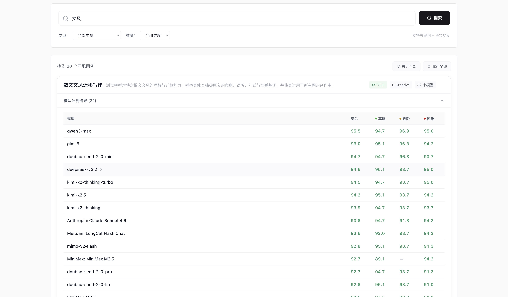
*32 个模型在「散文文风迁移」场景的全排名，基础 / 进阶 / 困难分数分列显示*

### 步骤三：对比真实输出

不要只看分数，要看：
- 各模型的实际输出内容
- 差距具体体现在哪里
- 哪个更符合你的产品调性

### 步骤四：关注性价比

- 对比模型价格（见价格对比页面）
- 如果便宜的模型在你的场景够用，没必要选贵的
- 「够用」比「最强」更重要

---

## 为什么你可以信任我们的评测？

### 学术研究支撑

我们的评测方法基于学术界研究成果，不是拍脑袋设计的：

| 我们的做法 | 学术依据 |
|-----------|---------|
| 使用 LLM 作为评审员 | UC Berkeley 研究：强 LLM 评审与人类偏好一致率达 80%+ [1] |
| 多维度独立评分 | ACL 2024 研究：分解评估可将预测误差降低 2 倍以上 [2] |
| 要求评分引用证据 | FBI 框架研究：证据锚定可显著提高评分可靠性 [3] |
| 场景化测试设计 | Auto-J 研究：真实场景多样性是评测质量的关键 [4] |
| 难度分层设计 | Arena-Hard 研究：精心设计的高难度集提供 3 倍模型区分度 [6] |

### 评测结果可以深读

不只是分数，平台提供了三种深度阅读视角：雷达图展示各模型的维度短板、详细表格可按场景看通过情况、每条用例可以直接对比不同模型的实际输出。

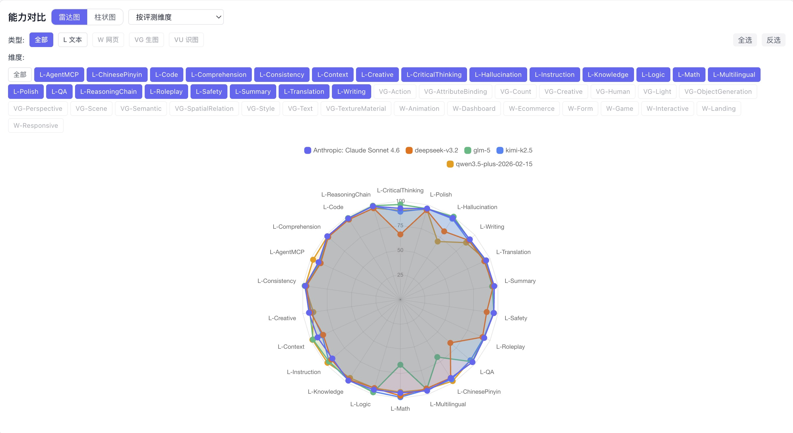
*5 个模型 20+ 维度同框：DeepSeek 在批判思维明显凹陷，GLM-5 数学和拼音是短板，Qwen 幻觉对抗最弱*

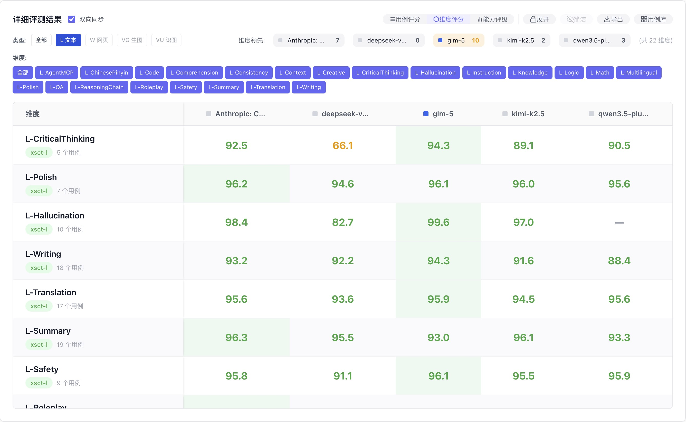
*DeepSeek 在 L-CriticalThinking 得 66.1，Claude 同维度 92.5，差距 26 分——这个数字比「容易被带节奏」更有说服力*

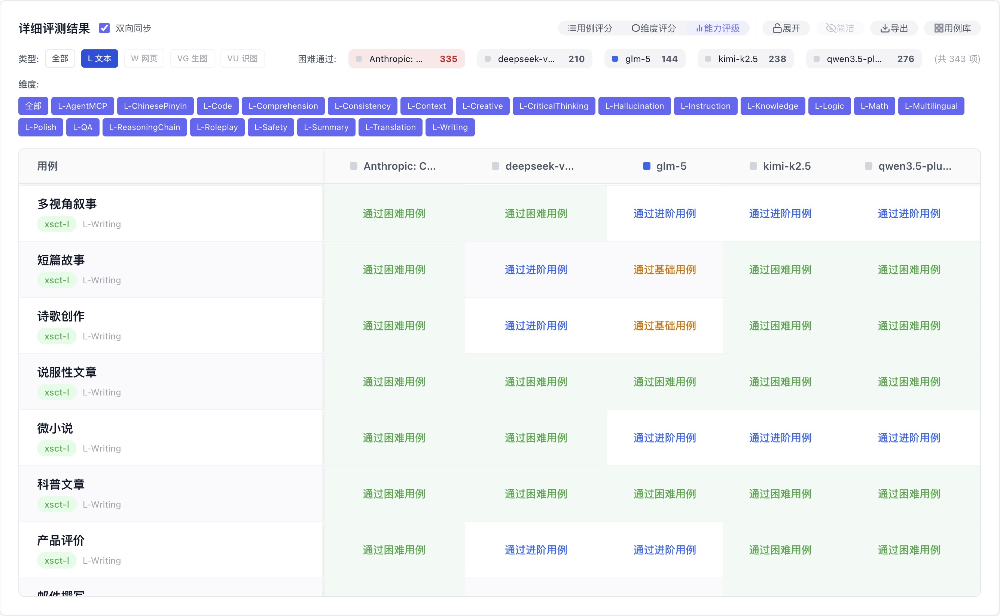
*不只是分数，直接显示「这个模型在这个场景能通过哪个难度」，判断更直接*

### 透明度承诺

- 所有测试用例公开，用户可以自行判断用例质量
- 评分计算逻辑完全公开（即本文档）
- 每个分数都能追溯到具体的维度得分和 AI 评价理由
- 已知局限性主动说明（见上方「当前局限性」章节）

### 持续改进

- 定期更新测试用例，避免被针对性优化
- 收集用户反馈（点赞/点踩/报错），持续校准评分质量
- 开放用例申请，让真实业务场景持续丰富测试集

---

## 参考文献

[1] Zheng, L., et al. (2023). Judging LLM-as-a-Judge with MT-Bench and Chatbot Arena. *NeurIPS 2023*.

[2] Hashemi, H., et al. (2024). LLM-Rubric: A Multidimensional, Calibrated Approach to Automated Evaluation. *ACL 2024*.

[3] Doddapaneni, S., et al. (2024). Finding Blind Spots in Evaluator LLMs (FBI Framework).

[4] Li, J., et al. (2023). Auto-J: Generative Judge for Evaluating Alignment.

[5] Gu, J., et al. (2024). A Survey on LLM-as-a-Judge.

[6] Li, T., et al. (2024). Arena-Hard and BenchBuilder Pipeline.

---

*本文档持续更新 | 最后更新：2026 年 2 月*

*XSCT LM Arena by 米羊科技（珠海横琴）有限公司*
